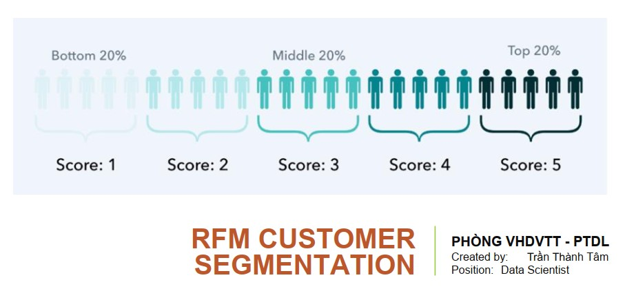
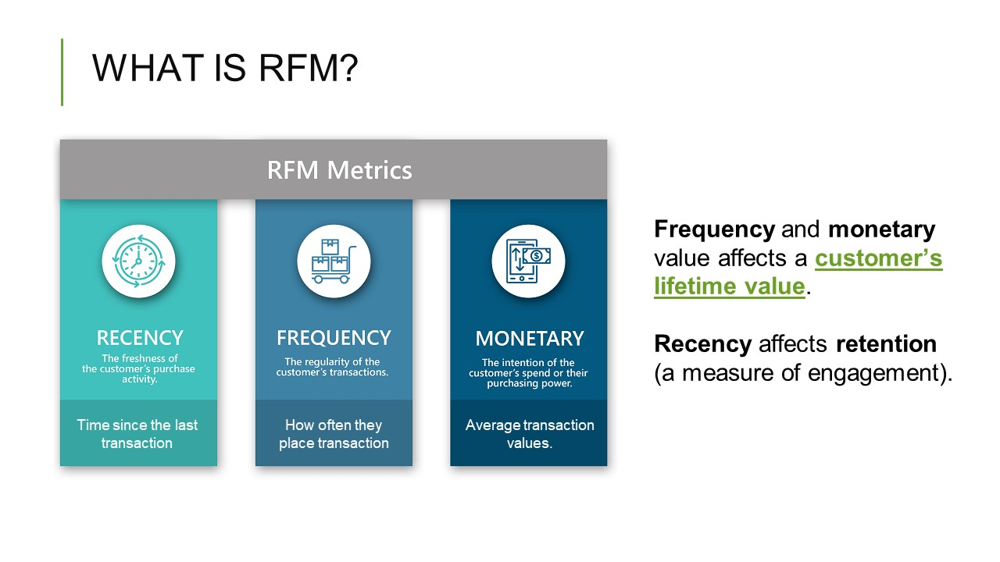
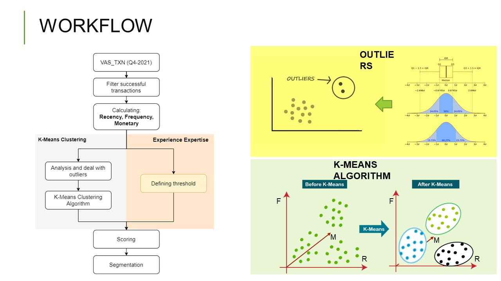
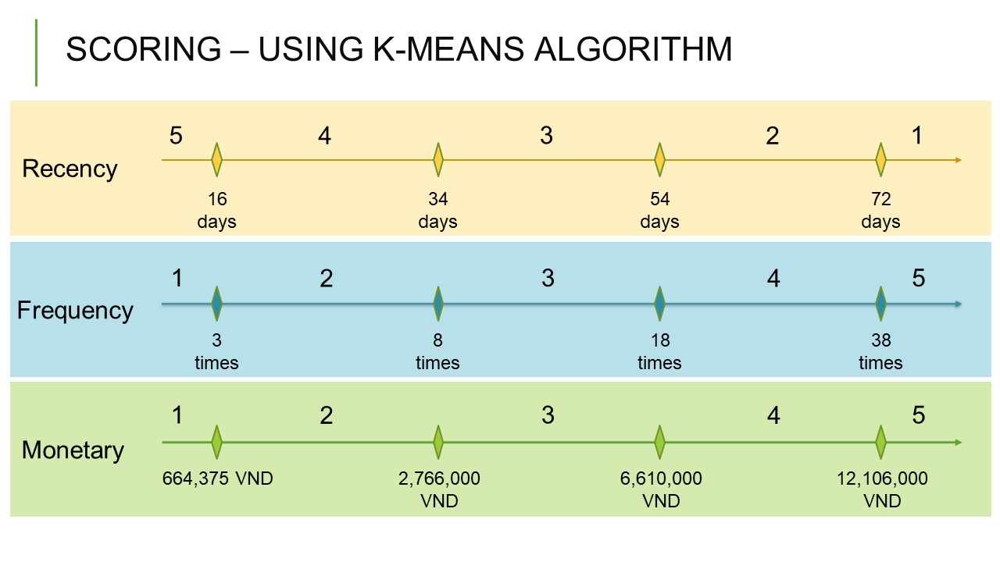
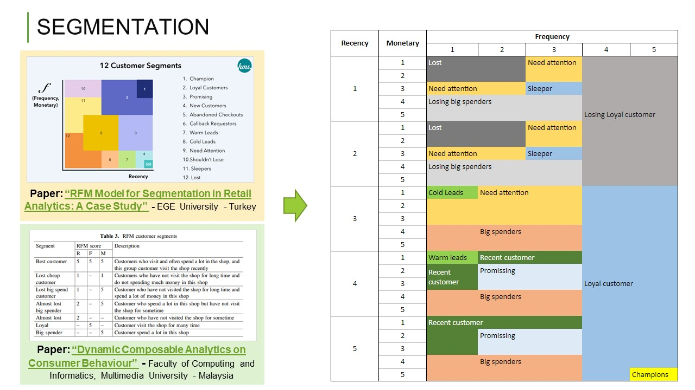
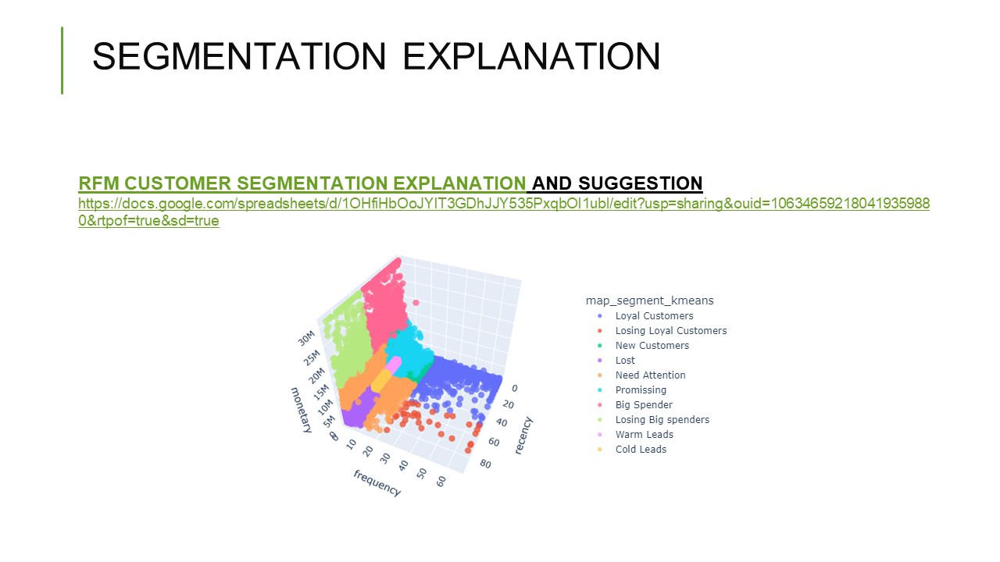
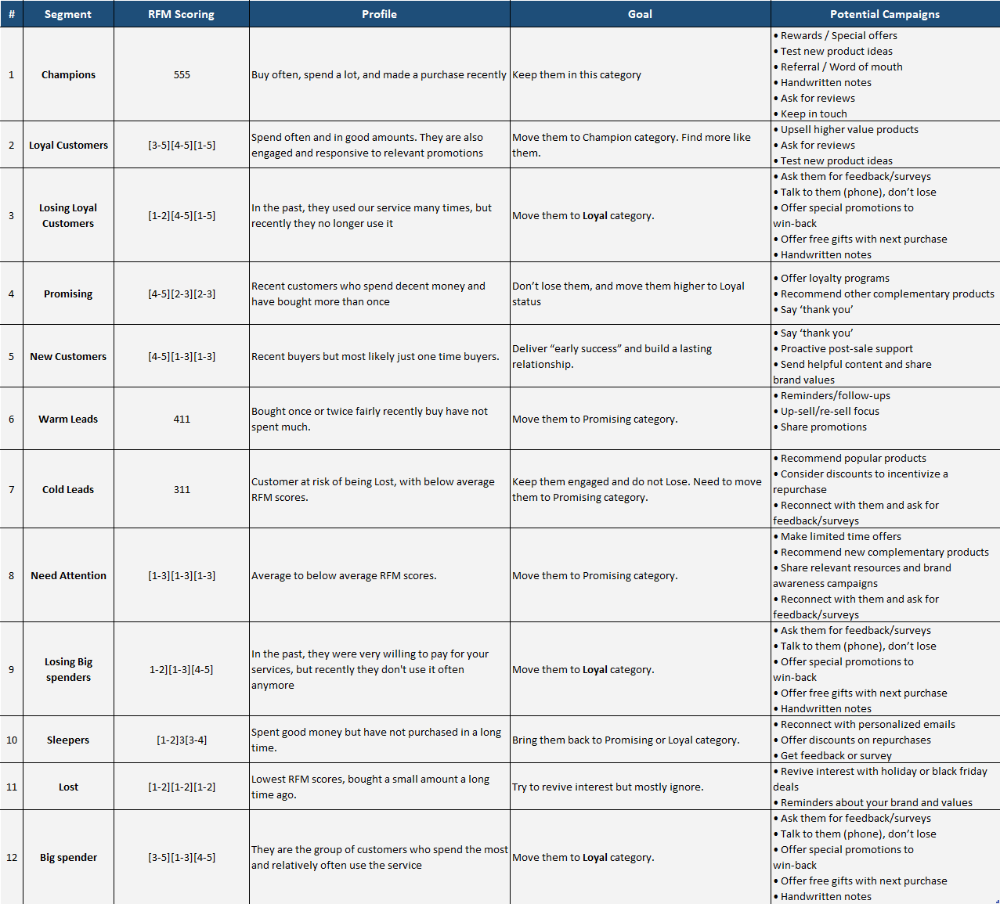
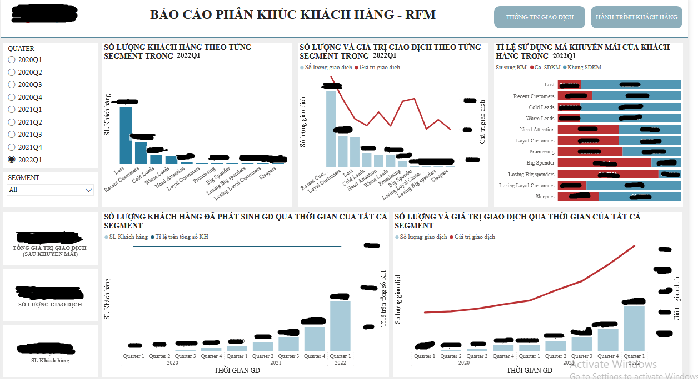
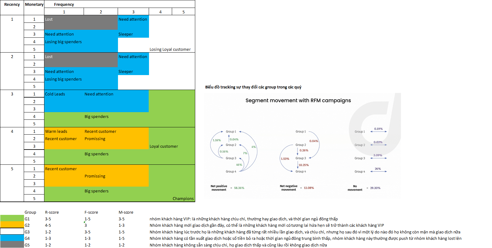

# RFM-Customer-Segmentation

## Introduction:

RFM segmentation is a great method to identify groups of customers for special treatment. RFM analysis allows marketers to target specific clusters of customers with communications that are much more relevant for their particular behavior – and thus generate much higher rates of response, plus increased loyalty and customer lifetime value. RFM stands for recency, frequency and monetary like the figure below.

+ Recency: Time since the last transaction

+ Frequency: How often customer place transaction

+ Monetary: Average transaction values

# Workflow:

I use transaction data in Q4-2021 to calculate the Recency, Frequency and Monetary values.

The next step is deal with outlier values using the Iterquartile Range (IQR) method and use the K-Means clustering model to cluster each iRFM values into 5 parts. As a result, we have the threshold value of each part as follows:

Based on the knowledge that I have gathered from 2 articles:
+ [“RFM Model for Segmentation in Retail Analytics: A Case Study" - EGE University - Turkey](https://dergipark.org.tr/en/download/article-file/951937)

+ [“Dynamic Composable Analytics on Consumer Behaviour”  - Faculty of Computing and Informatics, Multimedia University - Malaysia](https://www.researchgate.net/publication/326152612_Dynamic_Composable_Analytics_on_Consumer_Behaviour)

I group our customers into 12 segments as shown below:

## The way to apply:

On the last day of each quarter, the customer segmentation script code will run and save the results. I use this result and Power BI to create a report that help sales team to better understand their customers and devise effective marketing strategies.

## Segmentation version 2:

In practical application, with 12 segments will have a detailed view of customers. However, in order to make the work of customer caring easier, a necessity to simplify the quantity of segments.

After study, I propose a solution number of segments from 12 to 5 as the figure below:

